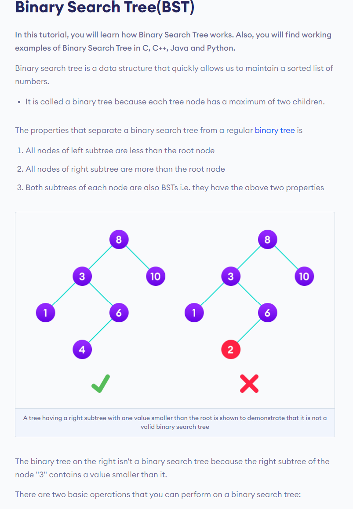
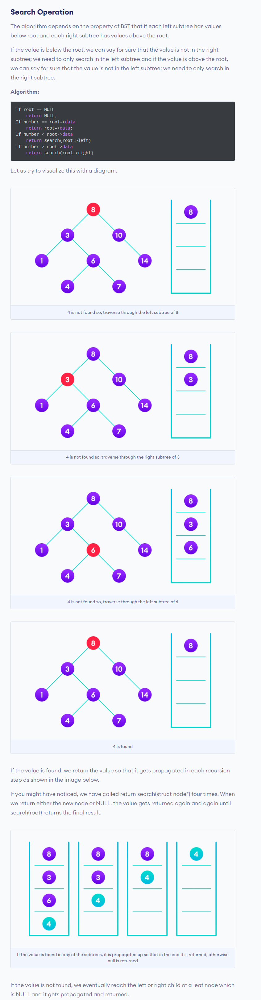
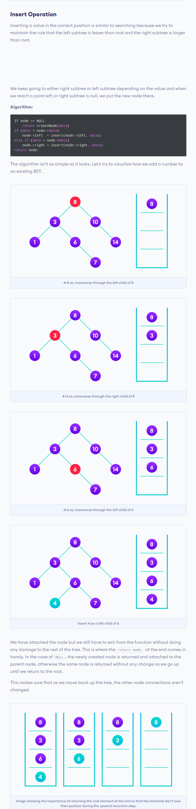
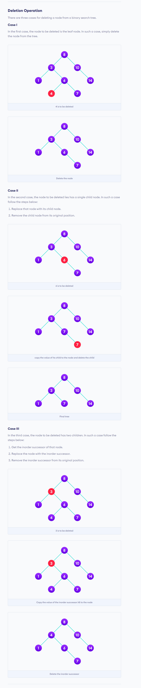

## Binary Search Tree 
##### source : https://www.programiz.com/dsa/binary-search-tree

<details>
  <summary> Basic : </summary>
  
  <br> 
  
     
  </details>
  
  <details>
  <summary> Search Operation : </summary>
  
  <br> 
  
     
  </details>
  
  <details>
  <summary> Insertion : </summary>
  
  <br> 
  
     
  </details>
  
  <details>
  <summary> Delation : </summary>
  
  <br> 
  
     
  </details>
  
<details>
  
  <summary> Code ( Insertion & inorder_traversal): </summary>
  
  <br> 
  
    ```

    #include<bits/stdc++.h>
    #define ll long long
    #define pb push_back
    #define fr(i,s,e) for(ll i=s;i<e;i++)
    #define rfr(i,e,s) for(ll i=e;i>=s;i--)
    #define nl  "\n"
    #define mod 1000000007
    #define fast ios_base::sync_with_stdio(0);cin.tie(NULL);cout.tie(NULL)
    using namespace std;

    struct node {
        ll val ;
        node *lf , *rig ;
    };

    node* insrt( node* nwnd , ll k ){

        if( nwnd == NULL ){
            node *temp = (node*) malloc(sizeof(node*)) ;
            temp->val = k ;
            temp->lf = temp->rig = NULL ;
            nwnd = temp ;
        }
        else {
            if ( k < nwnd->val )    nwnd->lf = insrt(nwnd->lf,k);
            else    nwnd->rig = insrt(nwnd->rig,k);
        }
        return nwnd ;
    }

    void trv(node* nd ){
        if (nd != NULL ){
            trv(nd->lf);
            cout << nd->val <<" "; 
            trv(nd->rig);
        }
    }


    int main(){

        ll n , x ;
        cin >> n ;
        node *root = NULL ;

        fr(i,0,n){
            cin >> x ;
            root = insrt(root,x);
        }

        trv(root);

    return 0 ;
    }

    ```
     
  </details>
  
