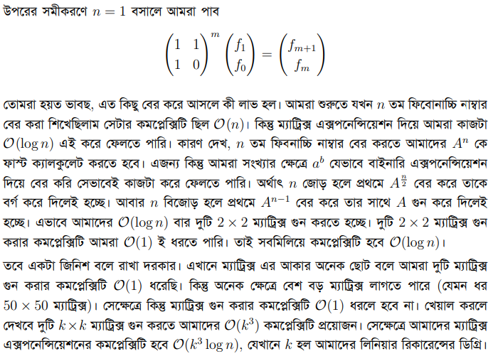
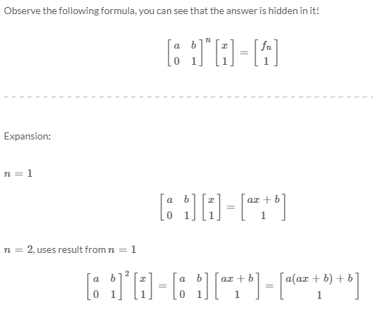

## Fibonacci using Matrix Multiplication 

<details>
<summary>  Explanation : </summary>

<br>
Book : <a href="https://drive.google.com/file/d/1uUu07phBuL3UYSo8dUAbtJX5OXw7Yqhn/view">DP book by Tasmeem Reza & Mamnoon Siam</a>

</details>

<details> 
<summary> N'th Fibonacci Code : </summary>

<br> 
  

  
```
  
#include<bits/stdc++.h>
#define ll long long
#define pb push_back
#define fr(i,s,e) for(ll i=s;i<e;i++)
#define rfr(i,e,s) for(ll i=e;i>=s;i--)
#define nl  "\n"
#define mod 1000000007
#define fast ios_base::sync_with_stdio(0);cin.tie(NULL);cout.tie(NULL)
using namespace std;

vector<vector<ll>> matrix_multiply ( vector<vector<ll>>&v1 , vector<vector<ll>>&v2 ){
    vector < vector<ll> > v ;

    fr(i,0,2){
        vector<ll>tv ;
        fr(j,0,2){
            ll nd = 0 ;
            fr(k,0,2){
                nd += (v1[i][k]*v2[k][j]);
            }
            tv.pb(nd);
        }
        v.pb(tv);
    }

    return v ;
}

int main(){
    ll n , m ;
    cin >> n ;
    m = n ;
    n -= 1 ;

    vector < vector<ll>> ans , res = {{1,1},{1,0}} , fun = {{1},{0}};
    ans = res ;

    while(n>0){
        if(n&1) ans = matrix_multiply(ans,res);
        res = matrix_multiply(res,res);
        n >>= 1 ;
    }

    cout << n <<"-th Fibonacci : " << ans[1][0] << endl;


return 0 ;
}


```
  

 <br>
 <br> 
  Complexity Analysis : 
  <br> 
   
</details>
  
<details>
  <summary> Related Problem : </summary>
  <br>
  Link : https://codeforces.com/contest/678/problem/D
  <br>
  Solution : https://codeforces.com/contest/678/submission/163947095
  <br> 
  Editorial : <br>
  
  
  
</details>
  
  
