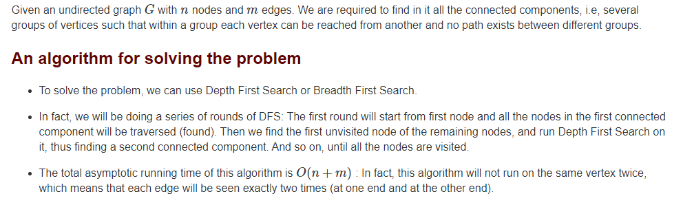

<details>
  
<summary>Explanation : </summary>

<br>
https://cp-algorithms.com/graph/search-for-connected-components.html#toc-tgt-2


### Snapshot : 


</details>


<details>
  <summary>Steps : </summary>
  <br>
  <b>To check Whether a graph's all node is connected or not , just do DFS single time. After completing DFS check visited[] , if there is "zero" , then this node is not visited because of no connectivity .</b>
  <br>
  
</details>
<details>

  
<summary> Code : </summary>
  
``` 
  
  
#include<bits/stdc++.h>
#define ll long long
#define pb push_back
#define fr(i,s,e) for(ll i=s;i<e;i++)
#define rfr(i,e,s) for(ll i=e;i>=s;i--)
#define nl  "\n"
#define mod 1000000007
using namespace std;
const int sz = 1e4; 

vector < ll > grp[sz]  ; 
ll vis[sz]; 
ll n , e , x , y , cnt ; 

void dfs(ll i){
    while ( !vis[i] ){
        vis[i] = cnt ; 
        for(auto a : grp[i]){
            if(!vis[a]){
                dfs(a);
            }
        }
    }
}


int main(){
    
    cin >> n >> e ; 

    fr(i,0,e){
        cin >> x >> y ; 
        grp[x].pb(y);
        grp[y].pb(x);
    }

    fr(i,1,n+1){
        if(!vis[i]) {
            cnt+=1;
            dfs(i);
        }
    }

    cout << "Total Components Set  : " << cnt << endl;  

    fr(i,1,n+1)
        cout << vis[i] <<" "; cout << endl;

return 0 ;
}
/*
input : 
8 8
1 2
1 3
2 3
4 5
4 6
5 7
6 7
8 8
Output : 
Total Components Set  : 3
1 1 1 2 2 2 2 3 
If Connected Components is Needed , then Get them from vis Array .
*/
  
```
</details>
