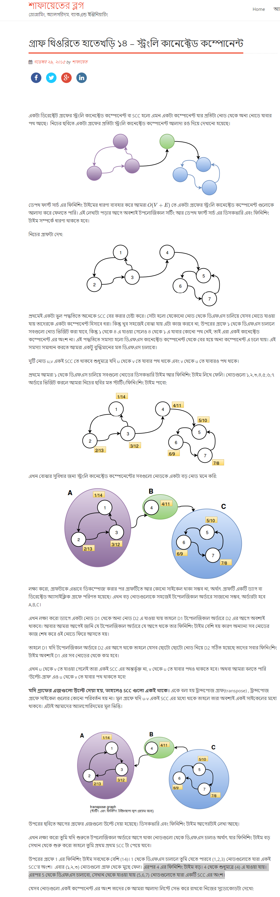
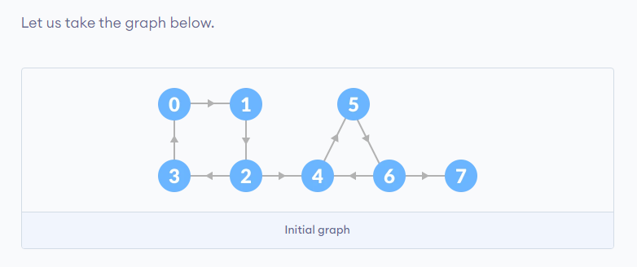
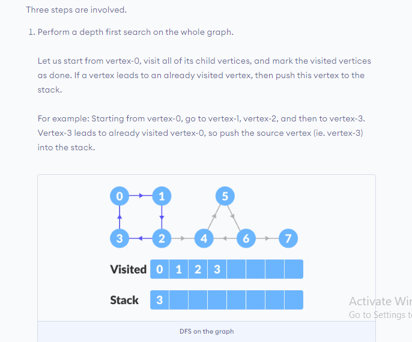
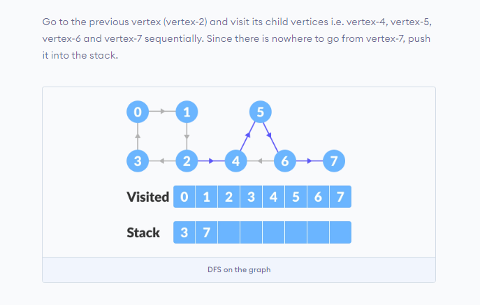
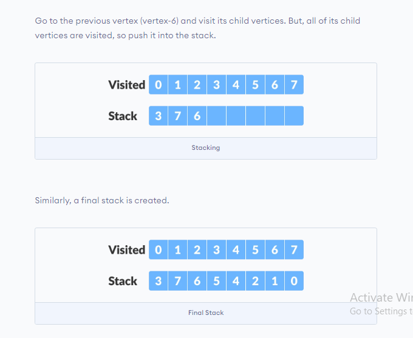
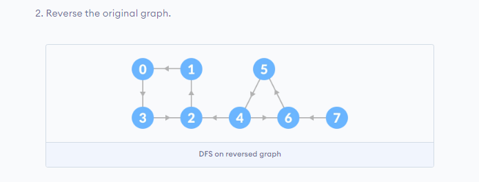
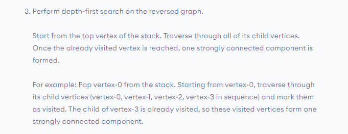
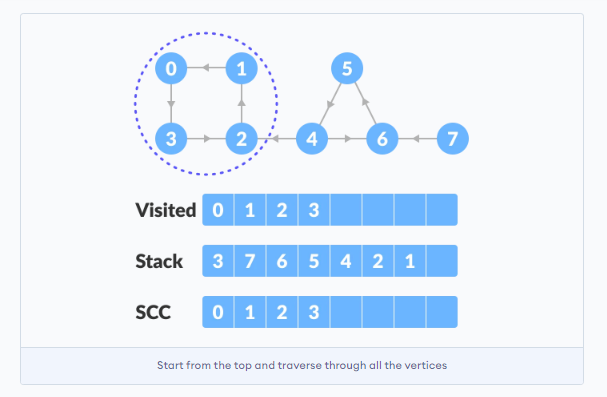
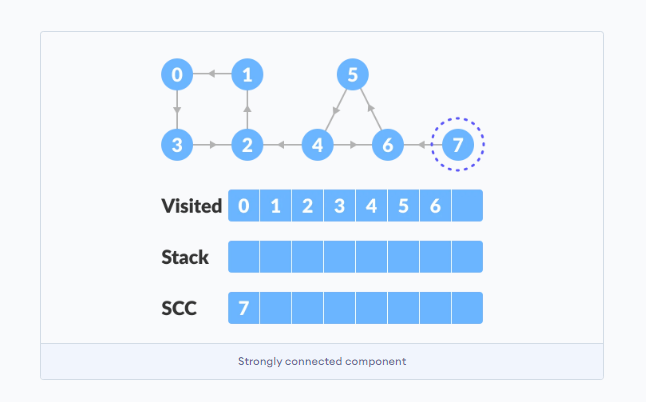
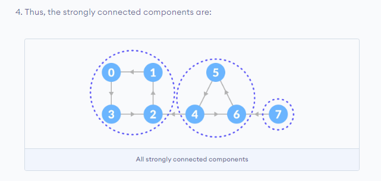

## Strongly Connected Component : 

A strongly connected component is <b>the portion of a directed graph</b> in which <b>there is a path from each vertex to another vertex</b>. <b>It is applicable only on a directed graph.</b>

<hr>
There are two algorithms to handle SCC . They are  : <br>
<ul>
  <li>Kosaraju's Algorithms</li>
  <li>Tarjan's Algorithms</li>
  </ul>


<hr>

#### Kosaraju's Algorithm Explanation :
<details> 
  <summary>Check : </summary>
  Source : http://www.shafaetsplanet.com/?p=2531
  <br>
  
  
  </details>
  
#### Kosaraju's Algorithm Steps :
<details> 
  <summary>Check : </summary> 
  
  <br>
  
  Kosaraju's Algorithm is based on <b>the depth-first search algorithm implemented twice.</b> <br>
  All Steps Listed Below one after another.Then a problem is Solved based on the given Steps.
  
  <ol>
    <li>Select a Source Node . </li>
    <li>Start DFS and Save Finishing time in a Array .</li>
    <li>If all node is not discovered yet ,then start again DFS from another node which is not discovered yet.</li>
    <li>After Discovering all nodes , Transpose the Graph. Transposing Graph means reverse the all direction as SCC is only applicable in Directed Graph.</li>
    <li>Do DFS again.Here , Source node it that node which have the most finishing time and Store all the node visited in one single DFS.</li>
    <li>If doing DFS is not possible anymore , then go back in <b>Finishing time array</b> , and check nodes are visited or Not.</li>
    <li>If not visited node is found , then start DFS again from that node.</b>
  <li>All the nodes visited in a single DFS on transpose graph form <b>Strongly Connected Components</b> </li>
  </ol>  
  
  <h3>Example : </h3>
  
  
  <br>
  
  <h5>1 ] First Step </h5>
  
  
  
  <h5>2 ] Second Step </h5>
  
  <h5>3 ] Third Step </h5>
  
  
  
   <h5> Final Result:  </h5>
  
  
    
    
  </details>
  
  
#### Kosaraju's Algorithm Code :
<details> 
  <summary>Check : </summary> 
  
```
#include<bits/stdc++.h>
#define ll long long
#define pb push_back
#define fr(i,s,e) for(ll i=s;i<e;i++)
#define rfr(i,e,s) for(ll i=e;i>=s;i--)
#define nl  "\n"
#define mod 1000000007
#define fast ios_base::sync_with_stdio(0);cin.tie(NULL);cout.tie(NULL)
using namespace std;

const ll sz = 1e3+5;
vector < ll > q ;
vector <ll>graph[sz] , Tgraph[sz] , used[sz] , SCC[sz];
ll vis[sz] , p ;


void dfs ( int i){
   vis[i] = 1 ;
   for(auto a : graph[i] ){
    if ( !vis[a] ){
        dfs(a);
    }
   }
   q.pb(i);
}

void Tdfs ( int i){
   vis[i] = 1 ;
   SCC[p].pb(i);
   for(auto a : Tgraph[i] ){
    if ( !vis[a] ){
        Tdfs(a);
    }
   }
}


int main(){

    ll n , e , x , y ;
    cin >> n >> e ;

    for( int i = 1 ; i <= e ; i++ ){
        cin >> x >> y ;
        graph[x].pb(y);
        Tgraph[y].pb(x);
    }

    // First Step :

    for( int i = 0 ; i < n ; i++ ){
        if ( !vis[i] ) dfs(i);
    }

    // Topo_Sorted _ Sorted By Finish Time

    reverse(q.begin(),q.end());


    memset(vis,0,sizeof(vis));

    // DFS again On Queue : 
    for(auto a : q ){
        cout << a << " "<< vis[a] << endl;
        if ( !vis[a] ){
            ++p;
            cout <<"YES\n";
            Tdfs(a);
        }
    }

    // Result : 
    for( int i = 0 ; i <= p ; i++ ){
            cout << i <<" : " ;
        for(auto a : SCC[i] )
            cout << a <<" ";
        cout << endl;
    }


return 0 ;
}

/*
8 9
0 1
1 2
2 3
3 0
2 4
4 5
5 6
6 4
6 7
*/


  ```
  
</details>

#### Complexity :
<details> 
  <summary>Check : </summary> 
  In this Algorithm , we have used DFS two times only. So , Complexity : 
  <b> O ( V + E ) </b> . 
  </details>
