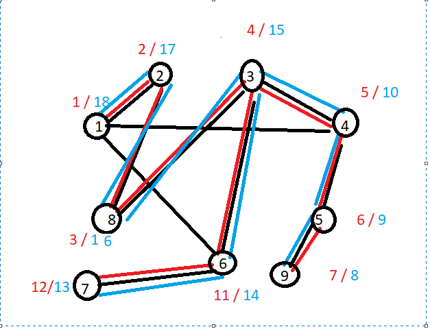
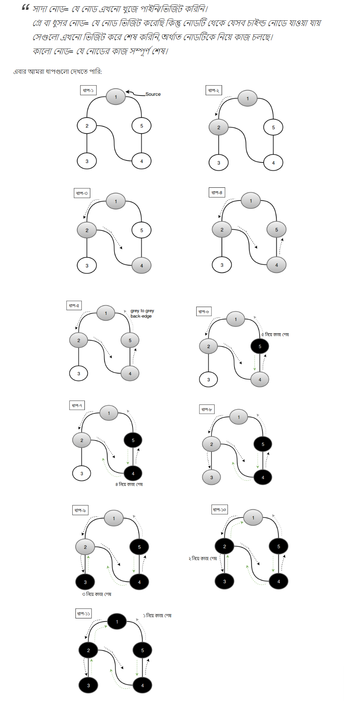

### Depth First Search : Source - <a href="https://cp-algorithms.com/graph/depth-first-search.html">CP _Agorithms</a>  | <a href="http://www.shafaetsplanet.com/planetcoding/?p=973">শাফায়েতের ব্লগ</a>
<br>
<br>

Depth First Search finds the lexicographical first path in the graph from a source vertex u to each vertex. Depth First Search 
will also **find the shortest paths in a tree (because there only exists one simple path)**, but on general graphs this is not the case.
<br><br>
**Complexity :**  **O(m+n)** 
<br>
<br>
#### Description of the algorithm :

The idea behind DFS is to **go as deep into the graph as possible**, and **backtrack once you are at a vertex without any unvisited adjacent vertices**.
<br><br>
We start the search at one vertex. After visiting a vertex, we further perform a DFS for each adjacent vertex that we haven't visited before. This way we visit all vertices that are reachable from the starting vertex.


In Depth first Search process ,we will use three marker to mark the situation of a node .
They are WHITE,GREY and BLACK.In this algorithm , <br><br>
                        white = 1 <br>
                        grey  = 2 <br>
                        Black = 3 <br><br>
Here, White means node still is not travelled .Grey means node is in under construction and Black means it is already travelled .
If a node marked as GREY or BLACk ,then we will not travell it anymore .We only go in a way when we get a white node.
Initially ,Every node are initialized with white which bearing the value one (1).
<br>
<br>
In the very first ,we start from a node and will check weather it is white /visited or not .If white we go for visit.After starting 
visit,first task is making this node is grey.After making grey ,then we will find it’s adjacent node .If it’s adjacent node is white ,
then we will call this DFS visit again. 
<br>
To keep color marker we will declare a Array which is initially white.

####  <a href="https://github.com/Sajjad-Hossain-Talukder/DataStructures-and-Algorithms/blob/main/Graph%20Theory/Graph%20Traversal/DFS.cpp">Code</a>
 
**Discover Time and Finish Time :**

input : 

```
9 10
1 2
1 4
1 6
2 8
3 8
3 4
4 5
5 9
3 6
6 7
```



**Discover time** indicate a value which actually represent **the touching time** and after end of travelling , we also can keep a marker of **Finishing** by using **Finish time**.


<br>

<br>


**From Safaet's Blog :** 
  



