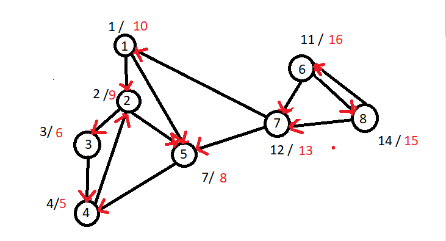
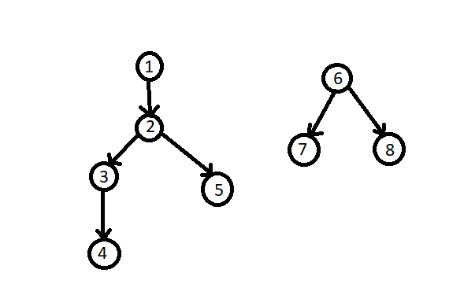
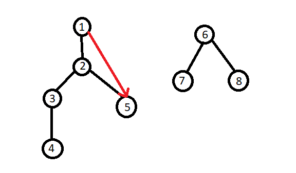
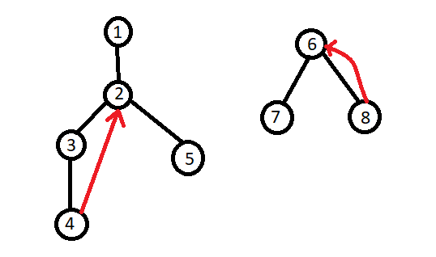
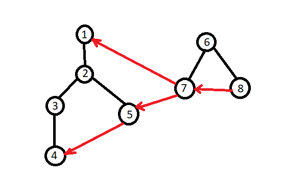

### Given Graph : 
  Using DFS , we've assigned discover time & finish time.
  
  
  
  <br> 
  <br>
  
###   Tree Edge :
It is an edge which is present in the tree **obtained after applying DFS on the graph**. All th edges below are tree edges. 
Tree edge Form **DFS TREE**.



<br> 
<br>

###   Forward Edge :
 It is an edge ( u , v) such that v is descendant but not part of the DFS tree.
 
<br> 
u = ancestor 
<br>
v = descendant
<br>
 


<br> 
<br>

###   Back Edge :
It is an edge  ( u , v) such that v is ancestor of node u but not part of DFS tree.

<br> 
u = descendant
<br>
v = ancestor 
<br>
 



<br> 
<br>

###   Cross Edge :
It is a edge which connects two node such that they **do not have any ancestor and a descendant relationship** between them. 




<br> 
<br>


### Input : 


```
8 13
1 2
1 5
2 3
2 5
3 4
4 2
5 4
7 1
7 5
6 7
6 8
8 6
8 7

```

### Output : 

```
Tree Edge :
1 2
2 3
3 4
2 5
6 7
6 8
Forward Edge:
1 5
Back Edge :
4 2
8 6
Cross Edge :
5 4
7 1
7 5
8 7
```

### Code : 

```
#include<bits/stdc++.h>
#define ll long long
#define pb push_back
#define fr(i,s,e) for(ll i=s;i<e;i++)
#define rfr(i,e,s) for(ll i=e;i>=s;i--)
#define nl  "\n"
#define mod 1000000007
#define fast ios_base::sync_with_stdio(0);cin.tie(NULL);cout.tie(NULL)
using namespace std;
ll n , e , x , y ,t;
vector < pair<ll,ll>> tre , bck , forwrd , cross ;
map<ll,ll>dis,fin ;


void dfs (ll i , vector<ll>*graph , ll *vis ){

    if( !vis[i]  ){

        vis[i] = 1 ;
        dis[i] = ++t;

        for( auto a : graph[i] ){
            if( vis[a] == 0 ){
                tre.pb( {i,a} );
                dfs(a,graph,vis);
            }
            else if( vis[a] == 1 )  bck.pb( {i,a} );
            else {
                if ( dis[i] > dis[a] )  cross.pb( {i,a} );
                else    forwrd.pb({i,a});
            }
        }
        
        vis[i] = 2 ;
        fin[i] = ++t ;

    }
    
    return ;
    
}

int main(){
    cin >> n >> e ;

    vector < ll > graph[n+1] ;
    ll vis[n+1];
    memset(vis,0,sizeof(vis));

    fr(i,0,e) {
        cin >> x >> y ;
        graph[x].pb(y);
    }

    fr(i,1,n+1){
        dfs(i,graph,vis);
    }
   


    cout << "Tree Edge : \n";
    for( auto a : tre )
        cout << a.first <<" "<< a.second << endl;

    cout << "Forward Edge: \n";
    for( auto a : forwrd )
        cout << a.first <<" "<< a.second << endl;

    cout << "Back Edge : \n";
    for( auto a : bck )
        cout << a.first <<" "<< a.second << endl;

    cout << "Cross Edge : \n";
    for( auto a : cross )
        cout << a.first <<" "<< a.second << endl;
        

return 0 ;
}


```

