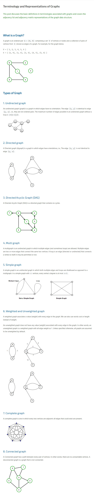

<details>
       <summary>Graph  & its Classification  :  </Summary>
       <hr> 
       <b>Graph : </b>A Graph is a <b>non-linear data structure</b> consisting of nodes and edges.A set of items connected by edges. Each item is called a vertex or node.
       <hr>
       <b>Undirected Graph : </b> A graph whose edges are <b>unordered pairs</b> of vertices. That is, each edge connects two vertices.<br>
       <b>__Note__:</b>  An undirected graph may be represented as a directed graph with two directed edges, one "to" and one "from," for each undirected edge.
       <hr>
       <b>Directed Graph - DiGraph - Oriented Graph : </b>  A graph whose edges are <b>ordered pairs</b> of vertices. That is, each edge can be followed from one vertex to another vertex.
       <hr>
       <b>Complete Graph : </b>An undirected graph with an <b>edge</b> between every pair of vertices.
       <hr>
       <b>Connected Graph : </b> An undirected graph that has a <b>path</b> between every pair of vertices.
       <hr>
       <b>Biconnected Graph : </b>
       A graph is said to be Biconnected if: <br>
1) It is connected, i.e. it is possible to reach every vertex from every other vertex, by a simple path. <br>
2) Even after removing any vertex the graph remains connected.
       <hr>
       <b>Bipartite Graph : </b> 
       An undirected graph where vertices can be partitioned into two sets such that no edge connects vertices in the same set.
<br>Note: A bipartite graph is a layered graph with two layers.
       <hr>
       <b>Strongly Connected Graph : </b> A directed graph that has a path from each vertex to every other vertex.
       <hr>
       <b>Strongly Connected Component : </b>  A strongly connected subgraph, S, of a directed graph, D, such that no vertex of D can be added to S and it still be strongly connected. Informally, a maximal subgraph in which every vertex is reachable from every other vertex.
       <hr>
       <b></b> 
       
       
              


       
 </details>
 
<details>
       <summary>What is Path ? </Summary>
       <p> path leads node "a" to node "b" through using one or 
       multiple egdes .
       The length of path = number of edges one node to another .
                          = sum of weigt of each edges involve in path ( weighted graph)
       </p>
</details>

                   
**Cycle :** if first and last node is same .

<hr>
**Simple Path :** if each node appears at most once in the path .<br>
              so ,we can tell cycle can't be a cycle cause at cycle first and last node is same.
              
 <hr>       
 
**Connected Graph :** if any there is a path between any two nodes. That means there is no single isolated node. <br>
                   if there is single isolated nodes available on graph that is not a connected graph.
                   
The connected components of a graph are called its components.

<hr>

**Tree :** A connected graph consists of n nodes and (n-1) edges .
<hr>
**Directed Graph :** A graph is directed if the edges can be traversed in one direction only.
<hr>
**Weighted Graph :** A graph is weighted if every edges assigned a weight which can be it distance or anyting else.
<hr>
**Neigbours :**   Two nodes are neigbours or adjacent if both are connected by a edge .
<hr>
**Degree :** Degree of a node is the number of its neighbours.
EQn : 2 * Total edge = Sum of total degree .
<hr>
**Regular Graph :** If the degree of every node is a constant.
<hr>
**Complete Graph :** If the degree of every node is n-1 . That means every single node is connected to each other .
<hr>
**Indegreee & Outdegree :** In directed graph , the number of edges that end at the nodes is Indegree of this node  and the <br>
                            number of nodes that start at the node is outdegree of that node .
<hr>

**Coloring :** In coloring of a graph , each node is assigned a color so that no adjacent nodes have the same color .
<hr>
**Bipartite Graph :** A graph  is bipartite of it is possible to color using two color only . That means if we 
                  can divide the nodes in two set , where memeber of same set has no edge , then it will be a bipartite graph.
                  Actually ,if any node's degeree is more than two , then this graph is not going to be bipartite graph .
<hr>                     
Simple Graph : if no edge starts and ends at same node and there are no multiple edges between two nodes , then it is a simple  graph.        
  
```
হ্যান্ডশেকিং লেমা একটা জিনিস আছে যেটা বলে একটা বিজোড় ডিগ্রীর নোডের সংখ্যা সবসময় জোড় হয়। উপরের গ্রাফে A আর C এর ডিগ্রী ৩, 
এরা বিজোড় ডিগ্রীর নোড। তাহলে বিজোড় ডিগ্রীর নোড আছে ২টা, ২ হলো একটা জোড় সংখ্যা। হ্যান্ডশেক করতে সবসময় ২টা হাত লাগে, ঠিক 
সেরকম একটা এজ সবসময় ২টা নোডকে যোগ করে। তুমি একটু চিন্তা করে দেখো:

২টা জোড় ডিগ্রীর নোডকে এজ দিয়ে যোগ করলে ২টা নতুন বিজোড় ডিগ্রীর নোড তৈরি হয়। ২টা বিজোড় ডিগ্রীর নোডকে এজ দিয়ে যোগ করলে ২টা 
বিজোড় ডিগ্রীর নোড কমে যায়। ১টা জোড় আর একটা বিজোড় ডিগ্রীর নোড যোগ করলে মোট বিজোড় ডিগ্রীর নোড সমান থাকে(এক পাশে কমে, 
আরেক পাশে বাড়ে)।তাহলে দেখা যাচ্ছে হয় ২টা করে বাড়তেসে বা ২টা করে কমতেসে বা সমান থাকছে, তাই বিজোর ডিগ্রীর নোডের সংখ্যা সবসময় জোড়।

একইভাবে এটাও দেখানো যায় একটা গ্রাফের ডিগ্রীগুলোর যোগফল হবে এজসংখ্যার দ্বিগুণ। উপরের গ্রাফে ডিগ্রীগুলোর যোগফল ১০, আর এজসংখ্যা ৫।
```
