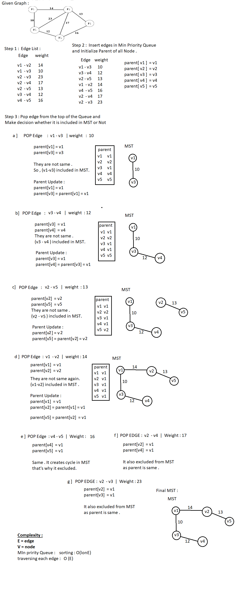
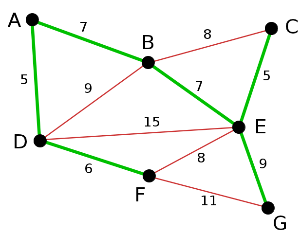
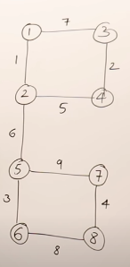
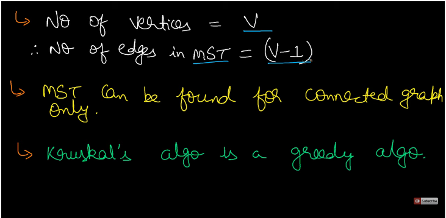
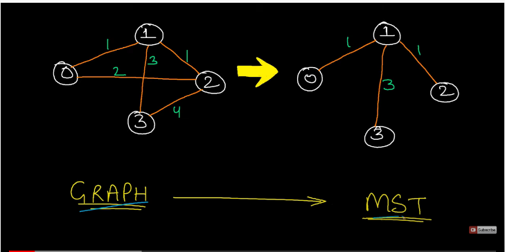
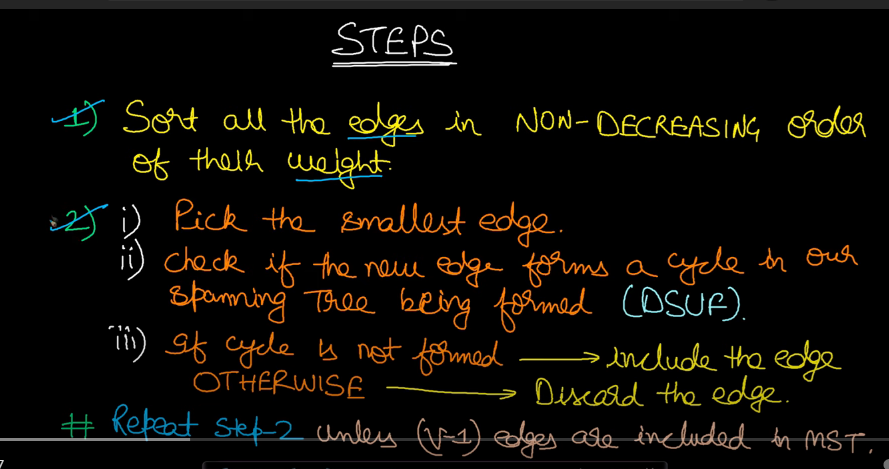
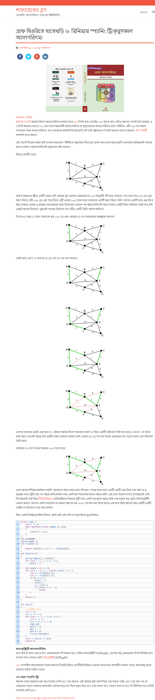

<details> 
  <summary> Example  : </summary>
  
  <br>
  
  **Step 0 :  1 . Delete Loop and Parallel Edge.**
  
  <br>
  
  
  </details>
 
 <details> 
  <summary> Input  : </summary>
  
```
7 11
1 2 7
1 4 5 
2 4 9
2 3 8
2 5 7 
3 5 5 
4 5 15
4 6 6  
5 6 8 
5 7 9 
6 7 11 

8 9
1 2 1
1 3 7
2 4 5
2 5 6
3 4 2
5 6 3
5 7 9
6 8 8
7 8 4

```




  
   </details>


 <details> 
  <summary> Source : </summary>
Vlog : 
Tech Dose : https://www.youtube.com/watch?v=_Iz-QLBGKpM <br>
Abdul Bari : https://www.youtube.com/watch?v=4ZlRH0eK-qQ

Blog : 
শাফায়েতের ব্লগ : http://www.shafaetsplanet.com/?p=825
  







  
  </details>


 <details> 
  <summary> Code : </summary>
  
  ```
  #include<bits/stdc++.h>
#define ll long long
#define pb push_back
#define fr(i,s,e) for(ll i=s;i<e;i++)
#define rfr(i,e,s) for(ll i=e;i>=s;i--)
#define nl  "\n"
#define mod 1000000007
using namespace std;
vector < pair <ll,ll> > result ; 

ll pathCompression ( ll parent[] , ll n ){
    if( parent[n] < 0 ) return n ;
    parent[n] = pathCompression(parent,parent[n]);
}

void Kruskal (ll parent[] , vector<pair<ll,pair<ll,ll>>>graph ){
  
    for(auto a : graph ){
        ll i = a.second.first , x = a.second.first ;
        ll j = a.second.second , y = a.second.second ;

        while( parent[x] > 0 || parent[y] > 0 ){
            if( parent[x] > 0 ) x = parent[x];
            if( parent[y] > 0 ) y = parent[y];
        }

        if( x != y ) {
            result.pb({i,j});
            if( parent[x] <= parent[y]){
                parent[x]+=parent[y] ;
                parent[y] = x ;
            }
            else {
                parent[y]+=parent[x] ;
                parent[x] = y ;
            }
            pathCompression(parent,i);
            pathCompression(parent,j); 
        }
    }
}

int main(){

    #ifndef CP
    freopen("input.txt", "r", stdin);
    freopen("output.txt", "w", stdout);
    #endif

    ll n , e , x , y , cost ;
    cin >> n >> e ;

    vector < pair<ll ,pair<ll,ll>>  > graph  ;
    ll parent[n+1];
    memset(parent,-1,sizeof(parent));
    

    fr(i,0,e){
        cin >> x >> y >> cost ;
        graph.pb({cost,{x,y}});
    }
    sort(graph.begin(),graph.end());
    Kruskal(parent,graph);
 
    for(auto a : result)
        cout << a.first <<" "<< a.second << endl;

return 0 ;
}


/*
Graph For testing : 
8 9
1 2 1
1 3 7
2 4 5
2 5 6
3 4 2
5 6 3
5 7 9
6 8 8
7 8 4

7 11
1 2 7
1 4 5 
2 4 9
2 3 8
2 5 7 
3 5 5 
4 5 15
4 6 6  
5 6 8 
5 7 9 
6 7 11 

*/
  ```

 </details> 
