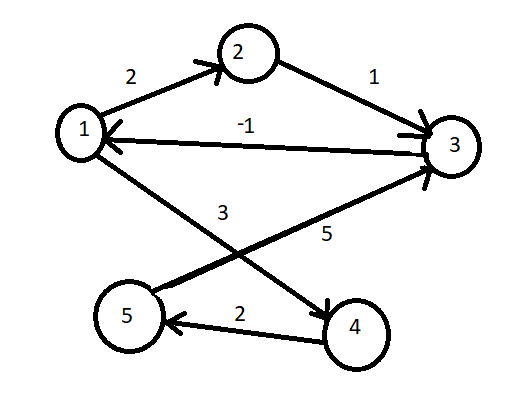

<details>
  <summary>Explanation : </summary>
  <br><b>Core Concept : </b> Shortest path contains at most n-1 edges, because the shortest path couldn't have a cycle.
  
  <br><b> So why shortest path shouldn't have a cycle ? </b>
  > There is no need to pass a vertex again, because the shortest path to all other vertices could be found without the need for a second visit for any vertices.
  
</details>
  
<details>
  <summary>Algorithm Steps : </summary>
  <br><ol>
    <li>The outer loop traverses N-1 Times.</li>
    <li>Every time check if the <b>next_node_distance > current_node_distance + edge_weight</b> , in this case update the <b>next_node_distance= current_node_distance + edge_weight</b>. </li>
  </ol>
  
  <h3> Negative Cycle Detection : </h3>
  <br>Traverse  one more time and Check distance . <b>if distance get changed in compare with previously obtained distance</b> , then Given graph must have a Negative Edge Weighted Cycle.<br>
  
</details>

<details>
  <summary>Code : </summary>
  
  ```
#include<bits/stdc++.h>
#define ll long long
#define pb push_back
#define fr(i,s,e) for(ll i=s;i<e;i++)
#define rfr(i,e,s) for(ll i=e;i>=s;i--)
#define nl  "\n"
#define mod 1000000007
#define fast ios_base::sync_with_stdio(0);cin.tie(NULL);cout.tie(NULL)
using namespace std;

struct node{
    ll x, y, cost ;
};

void path_print(vector<ll>&par, ll n ){
    if( par[n] == -1 ){
        cout << n <<" ";
        return ;
    }
    path_print(par,par[n]);
    cout << n <<" ";
}


int main(){
    ll n, e, p, q, c , source , flag = 1 ;
    cin >> n >> e >> source;

    vector < node > edgeList ;
    vector < ll > dist(n+1,INT_MAX), par(n+1,-1) , temp_dist(n+1);

    fr(i,0,e){
        cin >> p  >> q >> c ;
        edgeList.pb({p,q,c});
    }
    
    dist[source] = 0 ;
    
    for(int i = 1 ; i <= n ; i++ ){
        for(auto a : edgeList ){
            if(dist[a.y] > dist[a.x]+a.cost){
                dist[a.y] = dist[a.x]+a.cost;
                par[a.y] = a.x;
                if(i == n ) flag = 0 ;
            }
        }
    }

    if ( !flag ) cout <<"There is Negative Edge weighted Cycle\n";
    else {
        for(int i = 1 ; i <= n ; i++ ){
            cout << source <<" to " << i <<" : ";
            if(dist[i] == INT_MAX ) cout << "NO Path\n";
            else if ( dist[i] == 0 ) cout <<"Source Itself\n";
            else {
                path_print(par,i);
                cout << endl;
            }
        }
    }

    return 0 ;
}
/*
5 6 4
1 2 2
2 3 1
3 1 -5
1 4 3
4 5 2
5 3 5
*/


  ```
  
</details>
<details>
  <summary>Complexity : </summary>
  <br>Bellman-Ford is also simpler than Dijkstra and suites well for distributed systems. But time complexity of Bellman-Ford is O(VE), which is more than Dijkstra.
  <br><br>
  <b>Complexity : O(V*E) , Where V = Number of nodes & E = Number of Edges</b>
</details>
  

  <details>
    <summary>Graph : </summary>
    
   </details>
