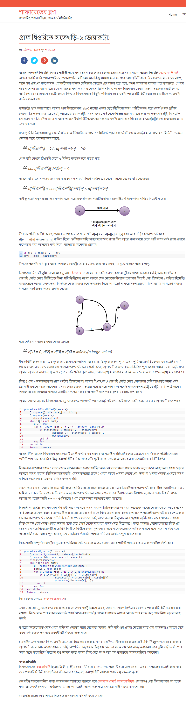

### Dijkstra's Algorithm :


<details>
<summary>Explanation : </summary>
  <br>
  source : http://www.shafaetsplanet.com/?p=1500
  <br>
  <br>
 
</details>
  
<details>
<summary>Algorithm Steps:</summary>
  <br>
<ol>
<li> Set  vertices distances = infinity | set the source distance = zero.</li> 
<li> Push the source vertex in a min-priority queue in the form (distance , vertex), /li>
<li> Pop the vertex with the minimum distance from the priority queue (at first the popped vertex = source).</li>
<li> Update the distances of the connected vertices to the popped vertex in case of (current vertex distance + edge weight < next vertex distance), then push the vertex
with the new distance to the priority queue.</li>
<li> If the popped vertex is visited before, just continue without using it.</li>
<li> Apply the same algorithm again until the priority queue is empty.</li>
  
</ol>
  <br>
</details>
<details>
<summary>Code : Using Min Priority Queue </summary>

```

#include<bits/stdc++.h>
#define ll long long
#define pb push_back
#define fr(i,s,e) for(ll i=s;i<e;i++)
#define rfr(i,e,s) for(ll i=e;i>=s;i--)
#define nl  "\n"
#define mod 1000000007
#define fast ios_base::sync_with_stdio(0);cin.tie(NULL);cout.tie(NULL)
using namespace std;

priority_queue < pair<ll,ll> , vector<pair<ll,ll>> , greater<pair<ll,ll>> >  pq ;

void path_print(vector<ll>&par, ll n ){

    if( par[n] == -1 ) {
        cout << n <<" ";
        return ;
    }
    path_print(par,par[n]);
    cout << n <<" ";
}

int main(){
    ll n , e , x , y , cst ;
    cin >> n >> e ;

    vector<pair<ll,ll>> graph[n+1];

    fr(i,0,e){
        cin >> x >> y >> cst  ;
        graph[x].pb({y,cst});
        graph[y].pb({x,cst});
    }


    pq.push({0,1});
    vector < ll >dist(n+1 , INT_MAX) ,vis(n+1,0) , par(n+1);
    dist[1] = 0 ;
    par[1] = -1 ;


    while(!pq.empty()){

        pair < ll , ll > p = pq.top();
        pq.pop();
        ll nd = p.second , cost = p.first ;

        if ( vis[nd] ) continue ;   else vis[nd] = 1 ;

        for(auto a : graph[nd] ){
            if ( dist[a.first] > cost+a.second && !vis[a.first] ){
                 dist[a.first] = cost+a.second ;
                 pq.push({dist[a.first],a.first});
                 par[a.first] = nd ;
            }
        }
    }

    // Printing Path from Source
    for(int i = 1 ; i <= n ; i++ ){
        cout << "1 to " << i <<" : ";
        path_print(par,i);
        cout << endl;
    }


    //Printing Distance
    for( int i = 1 ; i<= n ; i++ )
        cout << i <<" "<< dist[i] << endl;


return 0 ;
}
/*
Source index = 1 ;
5 6
1 2 2
2 3 1
1 3 1
1 4 3
4 5 2
5 3 5
5 6
1 2
2 3
1 3
1 4
4 5
5 3
*/

```

</details>
 

  
<details>
  <summary>Code : Using Set Container </summary>
  
```
#include<bits/stdc++.h>
#define ll long long
#define pb push_back
#define fr(i,s,e) for(ll i=s;i<e;i++)
#define rfr(i,e,s) for(ll i=e;i>=s;i--)
#define nl  "\n"
#define mod 1000000007
#define fast ios_base::sync_with_stdio(0);cin.tie(NULL);cout.tie(NULL)
using namespace std;
ll n , e , x , y , cst ;
set<pair<ll,ll>>s;

void path_print(vector<ll>&par, ll n ){

    if( par[n] == -1 ) {
        cout << n <<" ";
        return ;
    }
    path_print(par,par[n]);
    cout << n <<" ";
}

int main(){

    cin >> n >> e ;

    vector < pair<ll,ll>>graph[n+1];

    fr(i,0,e){
        cin >> x >> y >> cst ;
        graph[x].pb({y,cst});
        graph[y].pb({x,cst});
    }

    vector<ll>dist(n+1,INT_MAX) , vis(n+1,0) , par(n+1,-1) ;
    dist[1] = 0 ;                                    // source = 1
    s.insert({0,1});

    while ( s.size() ){

        auto it = s.begin() ;
        x = it->first , y = it->second ;
        s.erase(it);

        if ( vis[y] ) continue;  else vis[y] = 1 ;

        for(auto a : graph[y]){
            if ( dist[a.first] > x+a.second && !vis[a.first]){
                 dist[a.first] = x + a.second ;
                 par[a.first] = y;
                 s.insert({dist[a.first],a.first}) ;
            }
        }
    }

     // Printing Path from Source
    for(int i = 1 ; i <= n ; i++ ){
        cout << "1 to " << i <<" : ";
        path_print(par,i);
        cout << endl;
    }

    for( int i = 1 ; i<= n ; i++ )
        cout << i <<" "<< dist[i] << endl;


return 0 ;
}

/*
Source index = 1 ;
5 6
1 2 2
2 3 1
1 3 1
1 4 3
4 5 2
5 3 5
5 6
1 2
2 3
1 3
1 4
4 5
5 3
*/


  
```
   
</details>
  
  <details>
<summary> Output : </summary>
  
```
1 to 1 : 1
1 to 2 : 1 2
1 to 3 : 1 3
1 to 4 : 1 4
1 to 5 : 1 4 5
1 0
2 2
3 1
4 3
5 5
  
```
  
</details>
