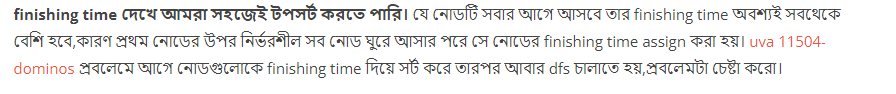

### Explain :

<a href="https://github.com/Sajjad-Hossain-Talukder/DataStructures-and-Algorithms/blob/main/Graph%20Theory/Topological%20Sorting/Topological%20Sort%20Explanation.md">Basic</a>

#### Solution 1 :



#### Solution 2 :

গ্রাফের **ইনডিগ্রি** হিসাবের মাধ্যমেও সল্যুশন করা যাই।  সেই **কমপ্লেক্সিটি O(n^2)**  । শুরুতে যাদের ইনডিগ্রি সবচাইতে কম তাদেরকে নিবো এবং এদের সাথে যাদের আউট এজ আছে তাদের ইনডিগ্রি কমিয়ে দিবো ১ করে। এইভাবে কন্টিনিউ হবে। 

### Code : 

```
#include<bits/stdc++.h>
#define ll long long
#define pb push_back
#define fr(i,s,e) for(ll i=s;i<e;i++)
#define rfr(i,e,s) for(ll i=e;i>=s;i--)
#define nl  "\n"
#define mod 1000000007
#define fast ios_base::sync_with_stdio(0);cin.tie(NULL);cout.tie(NULL)
using namespace std;

string x , y ;
ll t , n , e ;
map < string , vector < string > > mp ;
map < string , ll > vis ;
vector < pair< ll , string >> topo_order;

void dfs(string p ){
    if ( !vis[p] ){
        vis[p] = 1 ;
        ++t;
        for(auto a : mp[p] ){
            if ( !vis[a] )
                dfs(a);
        }
        topo_order.pb({++t,p});
    }
}


int main(){

    cin >> n >> e ;

    fr(i,0,e){
        cin >> x >> y ;
        mp[x].pb(y);
        vis[x] = 0 ;
        vis[y] = 0 ;
    }

    for(auto a : vis ){
        if ( !a.second )
            dfs(a.first);
    }

    sort(topo_order.begin(),topo_order.end()) ;

    for( int i = n-1 ; i >= 0 ; i-- )
        cout << topo_order[i].second <<" ";
    cout << endl;


return 0 ;
}

```
### Given Graph : 


### Input :
```
6 8
breakfast office
dressup office
office email
office dinner
office sport
email dinner
email sport
dinner sport
```

### Output :

```

dressup breakfast office email dinner sport

```

