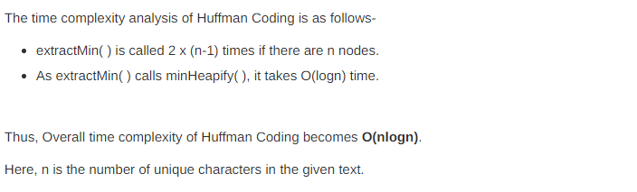

## Huffman Coding

**Defination :** Huffman Coding is a technique of <u>**compressing data to reduce its size without losing any of the details**</u>. It was first developed by David Huffman.

Huffman Coding is generally useful to compress the data in which there are frequently occurring characters.

<ul>
  <li>Huffman Coding is a famous Greedy Algorithm.</li>
<li>It is used for the lossless compression of data.</li>
<li>It uses variable length encoding.</li>
<li>It assigns variable length code to all the characters.</li>
<li>The code length of a character depends on how frequently it occurs in the given text.</li>
<li>The character which occurs most frequently gets the smallest code.</li>
<li>The character which occurs least frequently gets the largest code.</li>
<li>It is also known as Huffman Encoding.</li>
  </ul>
  
### Prefix Code - Rule : 
Set of binary Sequence , p such that no sequence in P is a prefix of any other 
sequence in P .

```
p = { 01 , 010 , 10 } 
Here , P is not a Prefix Code because '01' is been found in '010' as Prefix.
  
p = { 01 , 101 , 100 } 
Here , P is a Prefix Code.
  
```
<ul>
<li>Huffman Coding implements a rule known as a prefix rule.</li>
<li>This is to prevent the ambiguities while decoding.</li>
<li>It ensures that the code assigned to any character is not a prefix of the code assigned to any other character.</li>
</ul>


### Steps :

> Building a Huffman Tree from the input characters.

<ol>
<li> Create a leaf node for each character of the text. Leaf node of a character contains the occurring frequency of that character.</li>
<li> Arrange all the nodes in increasing order of their frequency value .</li>
<li> Considering the first two nodes having minimum frequency, Create a new internal node. </li>
<li>The frequency of this new node is the sum of frequency of those two nodes.</li>
<li>Make the first node as a left child and the other node as a right child of the newly created node.</li>
<li> Keep repeating ( Step-03 - Step-05 ) until all the nodes form a single tree.</li>
<li>The tree finally obtained is the desired Huffman Tree.</li>

</ol>

<h4> Then , </h4> 

assign all **Left Child 0** and **Right Child 1** in Huffman tree .


> Assigning code to the characters by traversing the Huffman Tree.


### Example : 

<br>


### Time Complexity : 

<br> 


### Decoding Encoded Message : 

<br> 


  
  
