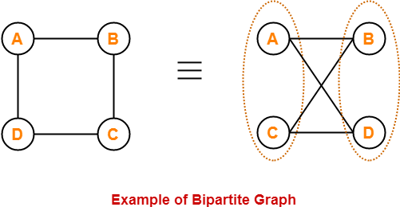

## Bipartite Graph

**Defination :** Bipartite graph is a special graph that can divide the 
vertex set into two disjoint sets such that  : 
<ol>
  <li>Each vertex belongs to exactly one of the 2 sets. </li>
  <li> Each edge connects vertices of 2 different sets.</li>
  <ol>

 

**It is  also known as Bigraph.**

### Example : 
   
