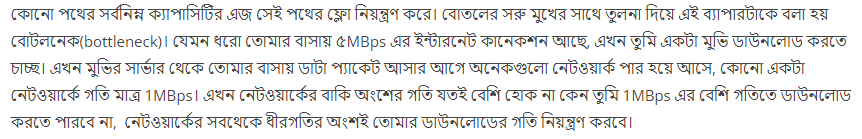

### Flow Network  : 

**Defination :**
A network is a <i> **directed graph G** </i> with **vertices V** and **edges E** combined with **a function c**, which assigns each edge e ∈ E a <i> **non-negative integer value, the capacity of e** </i>. Such a network is called a flow network, if we additionally label two vertices, one as source and one as sink.

### Flow : 

**Defination  :** <i>**A flow a is function f**</i> in flow network , that again <i>**assigns each edge e a non-negative integer value, namely the flow**</i>. 
  
   The function has to fulfill the following two conditions:
<ul>
  <li>The flow of an edge cannot exceed the capacity , i.e , f(e)≤c(e)</li>
<li>The <b>sum of the incoming flow</b> of a vertex u has to be equal to <b>the sum of the outgoing flow</b> of u <b>except in the source and sink vertices</b>.</li>
</ul>
  
**Note : The source vertex s only has an outgoing flow, and the sink vertex t has only incoming flow.**

### Maximum Flow : 
**Defination :** It is defined as the maximum amount of flow that the network would allow to flow from source to sink. 

 

### Augmenting Path :
It is the path available in a flow network.

 

### Residual Graph :
It represents the flow network that has additional possible flow.

 

### Residual Capacity :
It is the capacity of the edge after subtracting the flow from the maximum capacity. i.e , <b> R.Capacity = Capacity - Flow </b>

 

### Bottle neck Capacity :

Bottle neck Capacity of the augmented path is the Minimum Capacity of any edge on that particular path. 

#### Explanation : 

 

### Algorithms to Get Maximum Flow : 

The slow O(mf × E)  : <b> Ford-Fulkerson method. </b>   
The O(V × E^2) : <b> Edmonds-Karp algorithm. </b>   
The O(V^2 × E) : <b> Dinic's algorithm. </b>

### Maximum Flow Problem Example  :

We represent <b>edges as water pipes</b>, the capacity of an edge is the maximal amount of water that can flow through the pipe per second, and the flow of an edge is the amount of water that currently flows through the pipe per second. This motivates the first flow condition. There cannot flow more water through a pipe than its capacity.  

 
The vertices act as junctions, where water comes out of some pipes, and distributes it in some way to other pipes. This also motivates the second flow condition. In each junction all the incoming water has to be distributed to the other pipes. It cannot magically disappear or appear. The source s is origin of all the water, and the water can only drain in the sink t.
