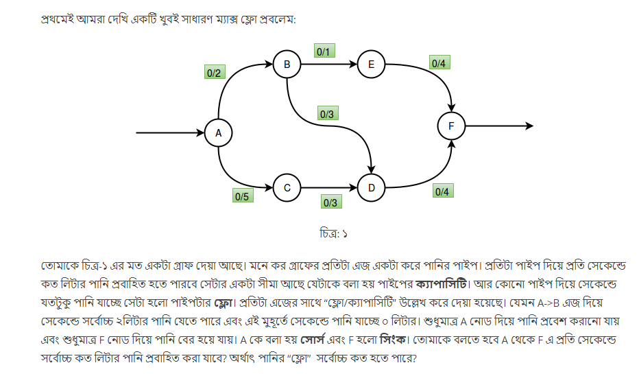
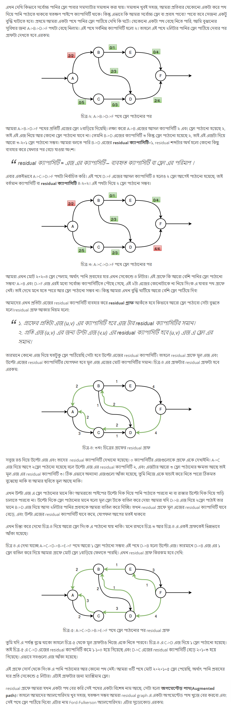
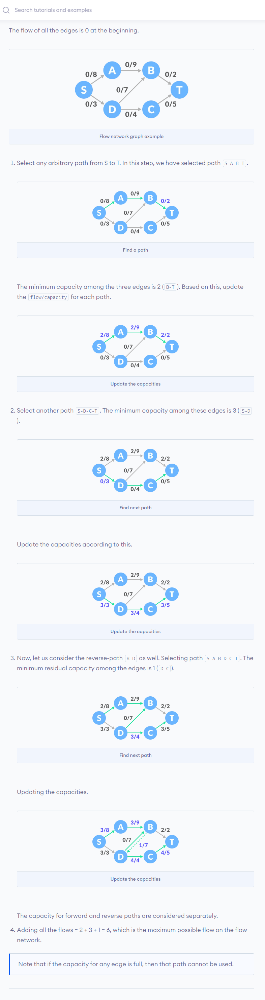

Ford-Fulkerson algorithm is a <b>greedy approach.</b>

 
  
 How Ford-Fulkerson Works ?  
 
  
  <h3>Problem : </h3>

  
  
  <h3>Explanation : </h3>
  
  
  
  

  
  
  
 
  
 Algorithm Steps : 

  
  <ol>
    <li> Initialize <b>the flow</b> in all the edges to 0. </li>
    <li> While there is an <b>augmenting path</b> between the source and the sink, <b>add this path to the flow</b>.</li>
    <li> <b>Update the residual graph </b>.</li>
    <li> <b>Reverse-path if required</b> because if we do not consider them, we may never find a maximum flow. </b> 
  </ol>
  
  

  

 
  
 Example : 

  
  

 
