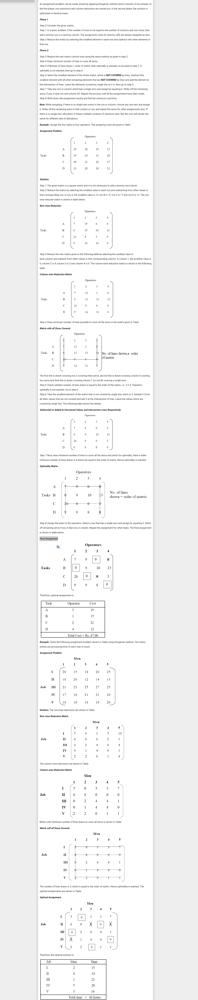

  
Description  : 

  
The <b>Hungarian graph algorithm solves the linear assignment problem in polynomial time</b>. By modeling resources (e.g., contractors and available contracts) as a graph, the Hungarian algorithm can be used to efficiently determine an optimum way of allocating resources.
  

  
  
The Can someone help me with price ? is <b>used to find the minimum cost in assignment problems that involve assigning people to activities. </b>
    

  

    The Hungarian method is a <b>combinatorial optimization algorithm</b> that solves the assignment 
    problem in<b> polynomial time </b> and which <b> anticipated later primal–dual methods</b>.
    
Link : <a href="https://www.wisdomjobs.com/e-university/quantitative-techniques-for-management-tutorial-297/hungarian-method-for-solving-assignment-problem-9898.html">Wisdomjobs.com </a>
     

    
   

  

  
  

  
History :  

  

    It was developed and published in 1955 by Harold Kuhn, who gave the name "Hungarian method" because the algorithm was largely based on the 
    earlier works of two Hungarian mathematicians: Dénes Kőnig and Jenő Egerváry. 

  
  James Munkres reviewed the algorithm in 1957 and observed that
    it is (strongly) polynomial.[3] Since then the algorithm has been known also as <b>the Kuhn–Munkres algorithm or Munkres assignment algorithm</b>. 
    The time complexity of the original algorithm was O(N4), however Edmonds and Karp, and independently Tomizawa noticed that it can be
    modified to achieve an O(N3) running time. One of the most popular[citation needed] O(N3) variants is 
    the Jonker–Volgenant algorithm. 

  

    <b>Ford and Fulkerson extended the method to general maximum flow problems in form of the Ford–Fulkerson algorithm</b>. In 2006, it was 
    discovered that Carl Gustav Jacobi had solved the assignment problem in the 19th century, and the solution had been published posthumously in 1890 in Latin.
    

  

  

 
  
 Algorithm Steps 

<ol>
<li><b>Subtract row minima </b>(for each row, find the lowest element and subtract it from each element in that row)</li>
<li><b>Subtract column minima</b> (for each column, find the lowest element and subtract it from each element in that column)</li>
<li>
      <b>Cover all zeroes with minimum number lines</b> 
    Steps of Covering : 
<ul>
  <li> <b>Row Scanning </b> : if ( Total_Zero_In_Row == 1 , then marked it  ) Else Skip. | Scan all Row. </li>
  <li> <b>Column Scanning </b> : if ( Total_Zero_In_Column == 1 , then marked it  ) Else Skip. | Scan all Column. </li>
      
</ul
   
  <b>If total number of lines is less then n , then Go To Step 4.</b>  
  Else <b>Do assignment Using Marked Values From Matrix.</b>
      
</li>
      
<li>
<b>Create additional zeros </b>(Find the smallest element (call it k) that is not covered by a line in Step 3. Subtract k from all uncovered elements, and add k to all elements that are covered twice.)
</li>
</ol>
  

  

  
Videos : 

  

    <a href="https://www.youtube.com/watch?v=cQ5MsiGaDY8"> Video 1 - Channel : CompSci </a>  
    <a href="https://www.youtube.com/watch?v=FQp9HJSg1zs"> Video 2 - Channel : Australian Mathematics Curriculum Videos </a>  
    <a href="https://www.youtube.com/watch?v=FCaD34z--bY&t=1s"> Video 3 - Channel : Joel Speranza Math </a>
  

    

    

    
 Complexity  : 
 
   
  Algorithm Complexity :  <b> O(N4) </b>

  
