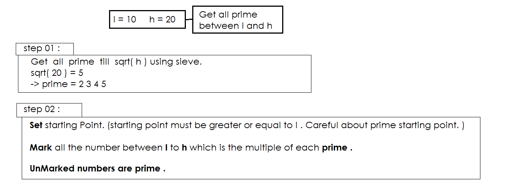

<details > 
    <summary> <b>Explanation : </b> </summary>
    


</details>

<details > 
    <summary> <b>Code :</b> </summary>
    
```

#include<bits/stdc++.h>
#define ll long long
#define pb push_back
#define fr(i,s,e) for(ll i=s;i<e;i++)
#define rfr(i,e,s) for(ll i=e;i>=s;i--)
#define nl  "\n"
#define mod 1000000007
#define fast ios_base::sync_with_stdio(0);cin.tie(NULL);cout.tie(NULL)
using namespace std;


ll l , h , d ;
vector<ll>prime , result_prime ;


void sieve(ll n ){
    vector < bool > temp(n+5,0) ;
    prime.pb(2);
    for(ll i = 3 ; i <= n ; i+=2){
        if( ! temp[i] ){
            prime.pb(i);
            if(i*i<=n){
                for(ll j = i*i ; j<=n ; j+=(i*2))
                    temp[j] = 1 ;
            }
        }
    }
}


void segmented_sieve ( ll l , ll h ){
    map <ll,ll> mp ;
    mp[1] = 0 ;
    sieve( sqrt(h)+1);

    for(auto a : prime ){
        ll st = (l/a)*a ;
        if ( st < l ) st += a ;
        if ( l <= a ) st = 2*a ;
        for(int i = st ; i <= h ; i += a )  mp[i] = 1 ;
    }

    for(ll i = l ; i <= h ; i++)
        if(!mp[i] ) result_prime.pb(i) ;

}


int main(){

    cin >> l >> h ;

    segmented_sieve(l,h) ;

    cout << result_prime.size() << endl;

    for(auto a : result_prime )
        cout << a <<" "; cout << endl;


return 0;
}

```

</details>
