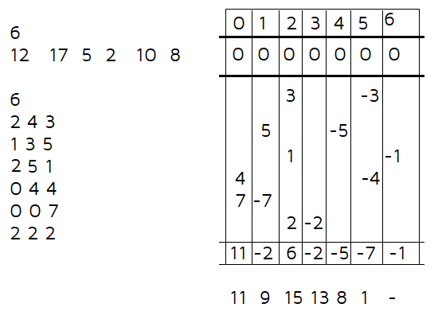

#### Given an array of n integers.Now , we need to update the elements of array and at last we need to print them.




<details>
  <summary>Code :</summary>
  
```
  
#include<bits/stdc++.h>
#define ll long long
#define pb push_back
#define fr(i,s,e) for(ll i=s;i<e;i++)
#define rfr(i,e,s) for(ll i=e;i>=s;i--)
#define nl  "\n"
#define mod 1000000007
#define fast ios_base::sync_with_stdio(0);cin.tie(NULL);cout.tie(NULL)
using namespace std;


int main(){
    ll n , q , x , y , z ;
    cin >> n ;

    ll a[n];
    fr(i,0,n) cin >> a[i];

    vector<ll>v(n+5,0);
    cin >> q ;

    while( q-- ){
        cin >> x >> y >> z ;
        v[x] += z ;
        v[y+1] += (z*(-1)) ;
    }

    fr(i,1,n) v[i]+=v[i-1];
    
    fr(i,0,n) cout << a[i]+v[i] <<" "; cout << endl;


return 0 ;
}

```


</details>
  
  
